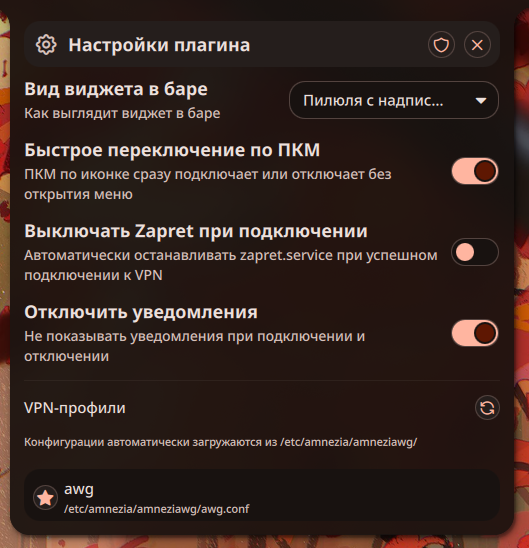

# AmneziaWG-dkms Plugin for Noctalia

[English](README.md) | [Русский](README.ru.md)

---

 

---

This plugin allows managing AmneziaWG VPN connections using the kernel space DKMS implementation directly from **Noctalia**.

---

## Dependencies & Requirements

* `amneziawg-tools` (provides `awg-quick` and `awg`)
* `amneziawg-dkms` (kernel module)
* `polkit` (provides `pkexec`)
* VPN configurations stored in `/etc/amnezia/amneziawg/`
* `zapret` (optional systemd service)

---

## Commands Used by the Plugin

The plugin runs the following commands under the hood:

### 1. Profile Discovery
To scan for available configurations:
```bash
pkexec ls /etc/amnezia/amneziawg/
```

### 2. Connection Management
To bring the interface **up**:
```bash
pkexec awg-quick up <path_to_config>
```

To bring the interface **down**:
```bash
pkexec awg-quick down <path_to_config>
```

### 3. Status Checking
To check which interfaces are currently active:
```bash
awg show interfaces
```

### 4. Zapret Integration (Optional)
To check if Zapret is installed and active:
```bash
systemctl list-unit-files zapret.service
systemctl is-active zapret
```

To start and stop the service:
```bash
systemctl start zapret
systemctl stop zapret
```

## Polkit Configuration (execution without password)

To allow the plugin to manage VPN connections and list configuration files without constantly prompting for the administrator password via `pkexec`, you can create a Polkit rule.

Create the file `/etc/polkit-1/rules.d/10-noctalia-plugins.rules` with the following content:

```javascript
/* Allow system commands for Noctalia plugins without password for the wheel group */
polkit.addRule(function(action, subject) {
    if (action.id == "org.freedesktop.policykit.exec" &&
        subject.isInGroup("wheel")) {
        var program = action.lookup("program");
        if (program == "/usr/bin/ls" ||
            program == "/usr/bin/awg-quick" ||
            program == "/usr/bin/env" ||
            program == "/usr/bin/sh") {
            return polkit.Result.YES;
        }
    }
});
```

Ensure the file is owned by `root:root` and the permissions are set to `0644`.
