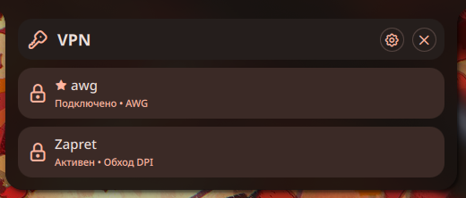

# Плагин AmneziaWG-dkms для Noctalia

[English](README.md) | [Русский](README.ru.md)

---

 

---

Этот плагин позволяет управлять VPN-подключениями AmneziaWG, использующими модуль ядра DKMS, непосредственно из **Noctalia**.

---

## Зависимости и требования

* `amneziawg-tools` (предоставляет `awg-quick` и `awg`)
* `amneziawg-dkms` (модуль ядра)
* `polkit` (предоставляет `pkexec`)
* VPN-конфигурации в директории `/etc/amnezia/amneziawg/`
* `zapret` (опциональная служба systemd)

---

## Команды, используемые плагином

Плагин выполняет следующие системные команды:

### 1. Сканирование профилей
Для получения списка доступных конфигураций:
```bash
pkexec ls /etc/amnezia/amneziawg/
```

### 2. Управление подключением
Для включения интерфейса (подключение):
```bash
pkexec awg-quick up <путь_к_файлу_конфигурации>
```

Для выключения интерфейса (отключение):
```bash
pkexec awg-quick down <путь_к_файлу_конфигурации>
```

### 3. Проверка статуса
Для определения активных в данный момент интерфейсов:
```bash
awg show interfaces
```

### 4. Интеграция с Zapret (Опционально)
Для проверки наличия и статуса службы Zapret:
```bash
systemctl list-unit-files zapret.service
systemctl is-active zapret
```

Для запуска и остановки службы:
```bash
systemctl start zapret
systemctl stop zapret
```
